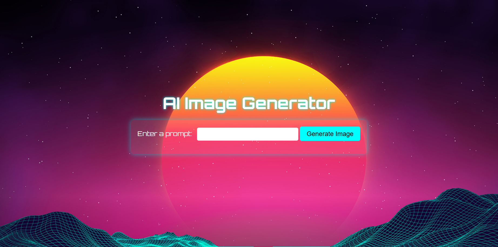
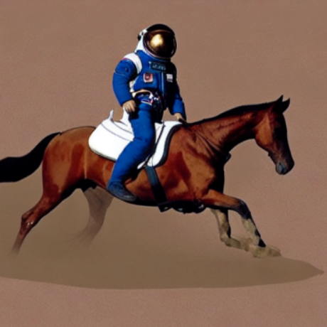
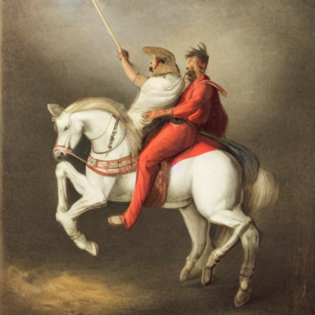

# ImgGenWebsite



## Description

**ImgGenWebsite** is a small Python web application built with Flask that performs image generation using models from [Hugging Face](https://huggingface.co/). The project allows users to input text prompts and receive generated images based on those prompts.

## Features

- **Flask Web Framework**: Powers the backend and serves the web pages.
- **Hugging Face Models**: Utilizes state-of-the-art image generation models.
- **Responsive Design**: Simple and clean web interface for easy interaction.

## Performance Considerations

Please note that the image generation process can be slow due to limited computational resources. The model requires significant processing power, and without access to high-performance hardware (such as GPUs), it may take a while (up to hours) to generate images.

## Example images

Here is an example of a generated image using the literature famous prompt "a photo of an astronaut riding a horse on mars".


Here are other examples; "a man riding a horse and swinging a sword" 


"a project manager studying project costs"


"an entrepreneur that is at the sea and wants to relax but keeps getting phone calls"


### Clone the Repository

```bash
git clone https://github.com/matteo-riga/ImgGenWebsite.git
cd ImgGenWebsite
python app.py
```
And go to http://127.0.0.1:2345/